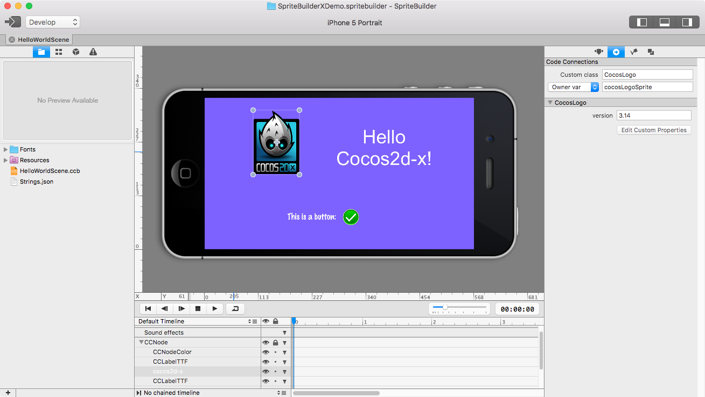
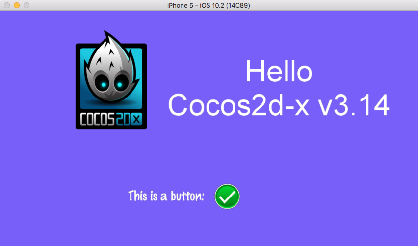

# SpriteBuilderX

    This branch requires the use of https://github.com/newnon/cocos2d-x

After you have created a new project with command line, then replace files completely inside `cocos2d` folder from `newnon/cocos2d-x/cocos`

Core Features:

* Designer-friendly UI
* Animation editor for scenes, characters and boned animations
* Timeless editor
* User interface designer
* Asset management & sprite sheet generation
* Tools for localization
* Publish to iOS & Android platforms
* Custom multi resolution support sysytem
* WYSIWYG editor


## Getting started with the source

Just Build & Run SpriteBuilder/SpriteBuilderX.xcodeproj 


## Still having trouble compiling SpriteBuilderX?

It is most likely still a problem with the submodules(also don't forget to recursively checkout submodules). Edit the .git/config file and remove the lines that are referencing submodules. Then change directory into the top directory and run:

    git submodule update --init --recursive

When building SpriteBuilderX, make sure that "SpriteBuilderX" is the selected target (it may be some of the plug-in targets by default).

## Main window



## Example of loading the scene and sprites with custom classes
```
bool HelloWorld::init() {

    if ( !Node::init() ) {
        return false;
    }

    CCBX_SIMPLE_MEMBER_VARIABLE(cocosLogoSprite);
    CCBX_SIMPLE_MEMBER_VARIABLE(labelHello);
    CCBX_SIMPLE_MEMBER_VARIABLE(clickedLabel);
    
    CCBX_SIMPLE_SELECTOR_CLICK(click);
    
    //custom loader
    cocos2d::spritebuilder::NodeLoaderLibrary *library = NodeLoaderLibrary::getDefault();
    library->registerNodeLoader("CocosLogo", &CocosLogoSpriteLoader::create);
    
    //simple loader, just examlpe, not been used or created in SBX
    using LevelNodeLoader = SimpleNodeLoader<LevelNode>;
    library->registerNodeLoader("LevelNode", &LevelNodeLoader::create);
    
    CCBXReader *reader = CCBXReader::createFromFile("HelloWorldScene.ccbi");
    cocos2d::Node * scene = reader->createNode(this, SceneScaleType::MINSCALE);
    this->addChild(scene);
    
    _labelHello->setString(StringUtils::format("Hello\nCocos2d-x v%s",_cocosLogoSprite->version.c_str()));
  
    return true;
}
```
## Final result



## Demo project

Please check https://github.com/KAMIKAZEUA/SpriteBuilderX-Demo

## License (MIT)
Copyright © 2011 Viktor Lidholt

Copyright © 2012-2013 Zynga Inc.

Copyright © 2013-2014 Apportable Inc.

Copyright © 2013 Apportable Inc.

Copyright © 2014-2017 Sergey Perepelitsa

Copyright © 2016-2017 Volodymyr Klymenko
 

Permission is hereby granted, free of charge, to any person obtaining a copy of this software and associated documentation files (the "Software"), to deal in the Software without restriction, including without limitation the rights to use, copy, modify, merge, publish, distribute, sublicense, and/or sell copies of the Software, and to permit persons to whom the Software is furnished to do so, subject to the following conditions:

The above copyright notice and this permission notice shall be included in all copies or substantial portions of the Software.

THE SOFTWARE IS PROVIDED "AS IS", WITHOUT WARRANTY OF ANY KIND, EXPRESS OR IMPLIED, INCLUDING BUT NOT LIMITED TO THE WARRANTIES OF MERCHANTABILITY, FITNESS FOR A PARTICULAR PURPOSE AND NONINFRINGEMENT. IN NO EVENT SHALL THE AUTHORS OR COPYRIGHT HOLDERS BE LIABLE FOR ANY CLAIM, DAMAGES OR OTHER LIABILITY, WHETHER IN AN ACTION OF CONTRACT, TORT OR OTHERWISE, ARISING FROM, OUT OF OR IN CONNECTION WITH THE SOFTWARE OR THE USE OR OTHER DEALINGS IN THE SOFTWARE.

